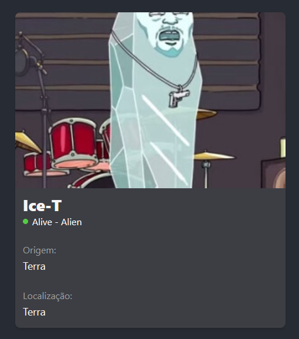

## Materiais GoogleDrive

## Nota final
- A nota final será de no máximo 10 pontos
- Estes pontos serão divididos em:

### 1. Avaliação ao final do Semestre
- Nota máxima 5,00 pontos
- Data da avaliação a ser definida
- Quem define a data da avaliação é a ITE e será postada no calendário da ITE
- Avaliação escrita
  - Poderá ser utilizado os computadores da ITE para a avaliação.
  - Não haverá acesso a internet
  - Não será possível o uso de cosulta
  - É extremamente proibido o uso de celulares ou componentes eletrônicos pessoais
  - A prova deverá ser transcrita a tinta para folha de prova

### 2. Avaliação durante o Semestre
- Nota máxima 5,00 pontos
- A avaliação será feita na forma de trabalho
- INDIVIDUAL

## Datas das aulas
- Haverá aula todos os dias letivos existentes no calendário, salvo exista alguma orientação contrária informada pela ITE ou pelo coordenador.

## Contato com o Professor
- Todo o contato com o professor deverá ser feito através de e-mail [rodrigo.noescobar@gmail.com](mailto:rodrigo.noescobar@gmail.com)
- Não responderei mais perguntas via WhatsApp

## Lista de presença
- Serão feitas duas chamadas, sendo:
    - Primeira entre 19h10 e 20h20, referente a primeira e segunda aula
    - Segunda entre 21h e 22h, referente a terceira e quarta aula
- Dúvidas sobre presença, verificar Regimento Educacional
- Atestados NÃO são dados ao professor e sim a secretaria da ITE

## Avaliação Substitutiva
- TODO o conteúdo será cobrado

## Exame
- TODO o conteúdo será cobrado

## Dúvidas?
- Leia novamente este documento

## Aula 01 - React (Data: 12/02/2025)
- Apresentação de disciplina

## Aula 02 - React (Data: 13/02/2025)
- Resumo da aula: Introdução ao npm, npx, criação de projeto React, estrutura de pastas, e criação de um novo App.js.
- [Link para a pasta da aula](./Aula02)

## Aula 03 - 19/10/2023
- Não haverá conteúdo, será aplicado avaliação de disciplina EAD

## Aula 04 - 20/02/2025
- Utilização de componentes
- Criação do componente App
- Import em Index.js
- Variáveis (useState)

## Aula 05 - 26/02/2025
- Passagem de parâmetros de pai para filho em componentes React
- Exemplos práticos e exercícios
- [Link para a pasta da aula](./Aula05)

## Aula 06 - 27/02/2025
- Importação de arquivo JSON
- Percorrer o arquivo JSON e montar uma tabela em React usando `map`
- Adicionar um input para pesquisa e utilizar `filter` para filtrar os dados da tabela
- [Link para a pasta da aula](./Aula06)

## Aula 07 - 06/03/2025
- Exercício: Criar uma calculadora em React
- Todos os botões deverão funcionar:
  - `C` = limpar
  - `+`, `-`, `*`, `/` = operações matemáticas
  - `=` = calcular resultado
- [Link para a pasta da aula](./Aula07)

## Aula 09 - 13/03/2025
- Calculadora em React
- Utilização de passagem de parâmetro de Filho para Pai
- [Link para a pasta da aula](./Aula09.md)
- Axios
- [Link para a pasta da aula](./Aula09-Axios.md)

## Aula 10 - 19/03/2025
- Exercícios (Axios)
- Trabalho para os presentes

## Aula 11 - 20/03/2025
- Trabalhando com Material UI

## Aula 12 - 26/03/2025
- **Trabalho**
  - Data de entrega: 27/03/2025
  - Nota: 1,00
  - Enviar Link do git para e-mail rodrigo.noescobar@gmail.com
   - Assunto: TASI - Trabalho Aula 12

- Utilizando MateiralUI, itens:
   - CARD
   - IMAGE
   - E qual mais achar necessário
- Acesse a [API](https://rickandmortyapi.com/documentation)
- Crie um componente CARD (não utilize o nome CARD para não gerar erros com o Material UI)
- Para cada personagem recebido (Axios), você deverá carregar seu componente CARD, passando por parâmetro os dados conforme imagem a seguir.

## Aula 13 - 27/03/2025
- Trabalhando com Rotas

## Aula 14 - 02/04/2025
- Continuação trabalhando com Rotas